# BAB 10
# SIMULASI PENDAHULUAN

Bab ini membahas simulasi pendahuluan sistem siLacak sebagai *proof of concept* sebelum sistem diuji menggunakan perangkat keras. Simulasi dilakukan untuk menunjukkan bahwa rancangan pelacakan pendaki berbasis GPS dan LoRa multi-hop dapat direpresentasikan secara komputasional, dijalankan secara end-to-end, menghasilkan paket lokasi, meneruskan paket melalui relay node, serta menampilkan hasil penerimaan pada base station. Dengan demikian, simulasi tidak hanya berfungsi sebagai visualisasi, tetapi juga sebagai sarana untuk menguji alur data, mengevaluasi model gangguan, dan menghasilkan metrik awal sebelum implementasi hardware.

Fokus simulasi pada Capstone 1 bukan untuk menggantikan pengujian lapangan. Nilai RSSI, SNR, *packet delivery rate* (PDR), link margin, dan loss pada simulasi merupakan hasil model komputasional, bukan hasil pengukuran RF langsung pada medan gunung nyata. Namun, simulasi tetap penting karena dapat membuktikan bahwa konsep sistem dapat berjalan, dapat diamati, dapat diukur, dan dapat dianalisis secara teknis. Hasil simulasi menjadi dasar awal untuk menentukan kebutuhan pengujian perangkat keras dan kalibrasi lapangan pada Capstone 2.

## 10.1 Tujuan Simulasi

Simulasi pendahuluan sistem siLacak bertujuan untuk memvalidasi rancangan sistem pelacakan pendaki berbasis GPS dan LoRa multi-hop sebelum memasuki fase implementasi perangkat keras. Simulasi ini mencakup pergerakan pendaki di jalur pegunungan, pembangkitan koordinat GPS sintetis, pemodelan gangguan posisi, perhitungan propagasi sinyal LoRa, pemilihan relay node, penerusan paket menuju base station, serta pencatatan hasil untuk evaluasi kuantitatif. Dengan alur tersebut, model matematis pada Bab 4, pemilihan metode pada Bab 5, spesifikasi sistem pada Bab 6, batasan pada Bab 7, dan arsitektur umum pada Bab 8 dapat diuji dalam satu rangkaian simulasi yang terintegrasi.

Tujuan teknis simulasi ini adalah sebagai berikut.

1. Memastikan alur data dari portable node yang dibawa pendaki, jaringan relay LoRa, hingga base station dapat berjalan secara end-to-end.
2. Mengevaluasi pengaruh topografi, jarak, vegetasi, obstacle radio, dan kondisi NLOS terhadap kualitas link LoRa.
3. Menguji gangguan GPS sintetis seperti TTFF, DOP, noise, multipath, drift, dan delay terhadap data lokasi yang dikirimkan.
4. Menghasilkan log simulasi dan grafik evaluasi yang dapat digunakan sebagai dasar penilaian kelayakan konsep sistem.

## 10.2 Arsitektur Simulasi

### 10.2.1 Platform Simulasi

Simulasi siLacak menggunakan ROS 2 Jazzy sebagai middleware untuk menjalankan logika sistem dan Gazebo Harmonic sebagai media visualisasi lingkungan tiga dimensi. ROS 2 menjalankan node-node simulasi yang saling bertukar data melalui mekanisme publish-subscribe, sedangkan Gazebo digunakan untuk menampilkan terrain gunung, posisi pendaki, relay node, base station, dan penanda visual jaringan. Pemisahan ini penting karena perhitungan teknis seperti GPS sintetis, link budget LoRa, routing, dan logging dilakukan pada node ROS 2, sedangkan Gazebo berperan sebagai representasi visual lingkungan.

Simulasi dapat dijalankan dalam dua mode. Mode pertama menggunakan Gazebo untuk memverifikasi posisi node dan pergerakan pendaki secara visual. Mode kedua menjalankan simulasi tanpa Gazebo untuk pengambilan data yang lebih ringan, misalnya ketika fokus simulasi adalah PDR, drop reason, atau statistik link budget. Kedua mode tetap menggunakan model radio, GPS, dan rute yang sama sehingga hasilnya tetap konsisten.

### 10.2.2 Komponen Arsitektur Simulasi

Komponen simulasi disusun berdasarkan alur kerja sistem nyata. Portable node menghasilkan posisi dan status perangkat, jaringan LoRa memproses kelayakan link dan routing, base station menerima paket yang berhasil, dashboard menampilkan status real-time, dan data logger menyimpan seluruh data untuk analisis pascasimulasi.

| Komponen | Peran dalam Simulasi | Luaran Utama |
|---|---|---|
| Node Pendaki | Mensimulasikan pergerakan pendaki, GPS sintetis, baterai, dan status perangkat. | Pose pendaki, koordinat GPS, DOP, error GPS, baterai. |
| Node Jaringan LoRa | Menghitung link budget, memilih relay, mengevaluasi PER, collision, duty cycle, dan status paket. | Route aktif, RSSI, SNR, margin, delivered/drop, drop reason. |
| Base Station | Menerima dan menampilkan paket lokasi yang berhasil sampai di titik akhir jaringan. | Data lokasi pendaki yang berhasil diterima. |
| Dashboard | Merangkum kondisi simulasi secara real-time pada terminal. | Status paket, PDR window, route, baterai, cuaca, dan link radio. |
| Data Logger | Menyimpan data posisi dan event jaringan selama simulasi berlangsung. | `positions.csv` dan `network_events.csv`. |
| Analisis Offline | Mengolah log simulasi menjadi metrik dan grafik evaluasi. | Grafik GPS error, RSSI, PDR, drop reason, dan ringkasan metrik. |

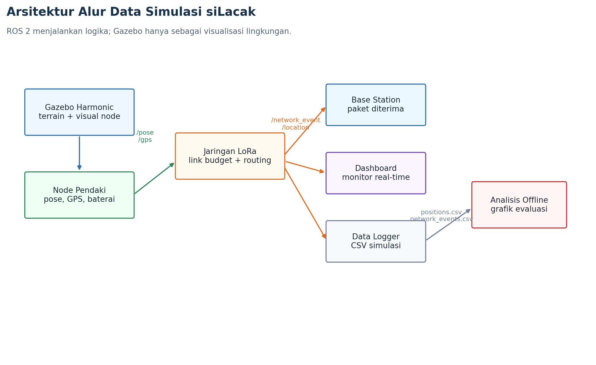

**Gambar 10.1. Arsitektur alur data simulasi siLacak.** Gambar 10.1 menyajikan hubungan antar-komponen simulasi, mulai dari node pendaki, jaringan LoRa, base station, dashboard, data logger, hingga modul analisis. Alur data menunjukkan bahwa posisi dan GPS sintetis diproses oleh model LoRa untuk menghasilkan keputusan pengiriman paket yang kemudian diteruskan ke base station dan dicatat sebagai data evaluasi. Kesimpulan yang diperoleh dari gambar ini adalah bahwa simulasi telah membentuk rantai kerja end-to-end dari pembangkitan lokasi sampai evaluasi hasil.

### 10.2.3 Topologi Jaringan LoRa dalam Simulasi

Topologi jaringan LoRa dalam simulasi terdiri atas satu base station, beberapa relay node, dan portable node yang dibawa oleh pendaki. Base station ditempatkan pada area basecamp sebagai pusat penerimaan data lokasi. Relay node ditempatkan secara bertingkat mengikuti jalur dan elevasi medan, mulai dari area bawah, hutan atau lembah, punggungan tengah, area kawah, hingga area summit. Penempatan bertingkat ini merepresentasikan strategi komunikasi multi-hop, yaitu paket tidak harus dikirim langsung dari pendaki ke base station, tetapi dapat diteruskan melalui node perantara yang memiliki kualitas link lebih baik.

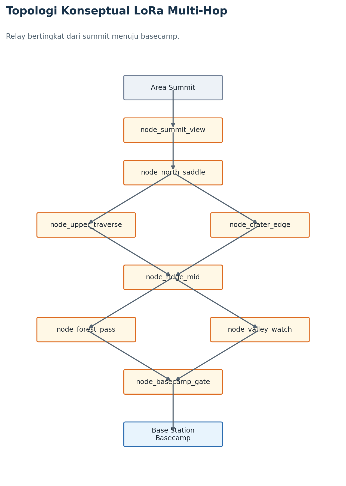

**Gambar 10.2. Topologi konseptual jaringan LoRa multi-hop.** Gambar 10.2 menggambarkan susunan konektivitas relay dari area summit menuju basecamp. Struktur bercabang menunjukkan bahwa route paket bersifat adaptif; paket dapat diarahkan melalui relay alternatif selama link radio dan jalur menuju base station masih layak. Kesimpulan yang diperoleh adalah bahwa konsep siLacak tidak bergantung pada satu link langsung, tetapi memanfaatkan relay bertingkat untuk meningkatkan peluang paket mencapai base station.

## 10.3 Pemodelan Simulasi

Simulasi siLacak dibangun atas empat domain model utama: lingkungan pegunungan, pendaki dan GPS, jaringan LoRa multi-hop, serta gangguan dan metrik evaluasi. Keempat domain tersebut menggunakan sistem koordinat yang sama sehingga posisi pendaki, posisi relay, altitude terrain, dan jarak radio saling konsisten. Prinsip ini penting karena kualitas link LoRa tidak hanya dipengaruhi jarak, tetapi juga oleh elevasi, obstacle, dan hubungan garis pandang antar-node.

### 10.3.1 Pemodelan Lingkungan

Lingkungan gunung dimodelkan sebagai terrain prosedural yang merepresentasikan fitur utama medan pegunungan, yaitu puncak, punggungan, lembah, area kawah, dan kekasaran permukaan. Bentuk terrain dibangun dari kombinasi fungsi matematis sehingga setiap titik memiliki koordinat lokal, ketinggian terrain, dan representasi visual yang konsisten. Skala yang digunakan adalah 1 world unit = 35 meter nyata. Skala ini membuat jarak antar-node dan panjang rute pada simulasi dapat dikaitkan dengan ukuran medan yang lebih realistis.

Koordinat lokal terrain juga dikonversi menjadi koordinat GPS sintetis menggunakan proyeksi equirectangular sebagaimana dirujuk pada Persamaan 4.1. Konversi ini menggunakan titik referensi geografis, kemudian mengubah perpindahan arah utara dan timur dalam meter menjadi perubahan latitude dan longitude:

$$
\Delta lat = \frac{north_m}{111320},\qquad
\Delta lon = \frac{east_m}{111320\cos(lat_0)}
$$

Dengan demikian, posisi yang terlihat di peta, dashboard, dan log GPS tetap merujuk pada titik yang sama di terrain simulasi.

Halangan radio dalam simulasi direpresentasikan sebagai zona abstrak pada peta, misalnya area vegetasi, batuan, kawah, dan bayangan terrain. Zona ini tidak dimaksudkan sebagai pemodelan setiap pohon atau batu secara individual, melainkan sebagai pendekatan untuk memberikan redaman tambahan ketika lintasan radio melintasi area yang secara fisik berpotensi menghambat propagasi. Redaman obstacle dihitung menggunakan faktor kedalaman lintasan di dalam zona obstacle (*depth factor*). Untuk vegetasi, simulasi juga menambahkan faktor basah (*wet factor*) ketika cuaca memburuk. Pendekatan ini merupakan penyederhanaan komputasional dari fenomena redaman vegetasi, sehingga parameternya tetap perlu dikalibrasi dengan pengukuran lapangan pada Capstone 2.

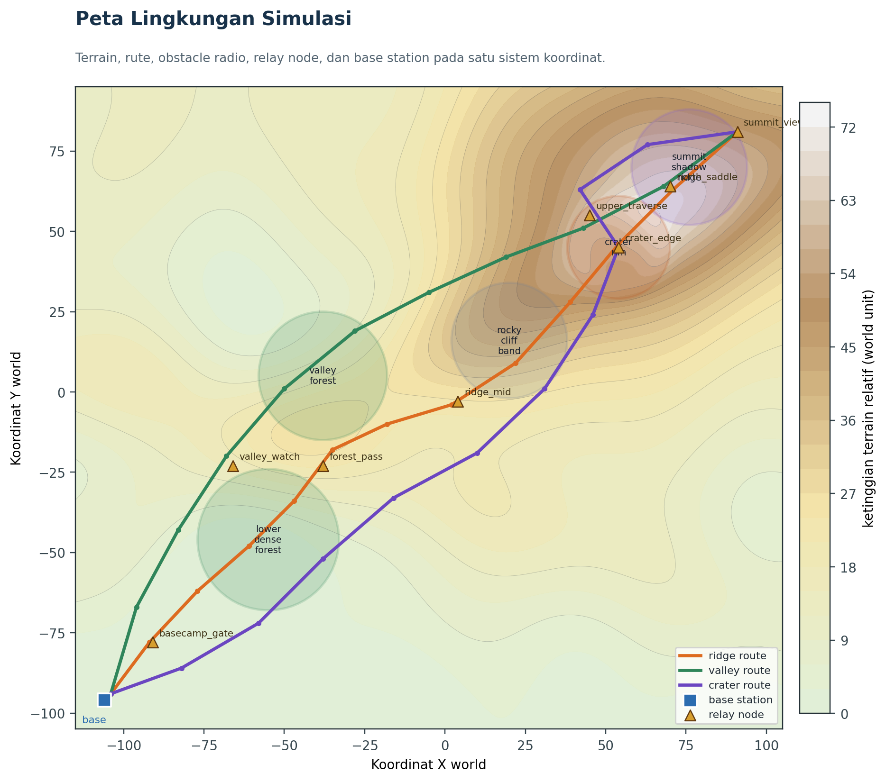

**Gambar 10.3. Peta 2D obstacle, rute, relay node, dan base station.** Gambar 10.3 menampilkan representasi spasial lingkungan simulasi pada bidang 2D. Informasi rute, posisi relay, base station, dan zona obstacle digunakan sebagai dasar perhitungan jarak, link budget, serta peluang pelemahan sinyal akibat kondisi medan. Kesimpulan yang diperoleh adalah bahwa lingkungan simulasi tidak hanya bersifat visual, tetapi juga menjadi input utama bagi model propagasi radio.

Terrain juga digunakan untuk mengevaluasi kondisi LOS/NLOS. Jalur radio antar-node disampling pada beberapa titik, kemudian profil terrain dibandingkan dengan garis LOS dan ruang clearance yang merepresentasikan zona Fresnel. Jika terrain menghalangi lintasan, simulasi menambahkan terrain shadow loss dan diffraction loss. Konsep difraksi mengacu pada model knife-edge Fresnel-Kirchhoff pada Persamaan 4.13 dan Persamaan 4.14, tetapi implementasi simulasi menggunakan sampling terrain dan heuristik clearance agar ringan dijalankan secara real-time.

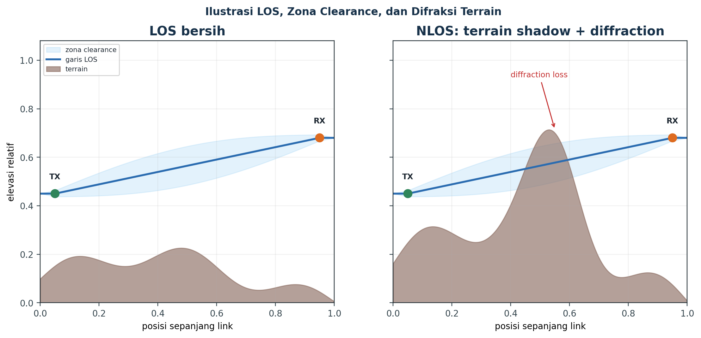

**Gambar 10.4. Ilustrasi LOS, terrain shadow, dan diffraction loss.** Gambar 10.4 mengilustrasikan pengaruh profil terrain terhadap lintasan radio. Ketika terrain memotong ruang propagasi atau berada dekat jalur LOS, model menambahkan terrain shadow loss dan diffraction loss sebagai komponen redaman tambahan. Kesimpulan yang diperoleh adalah bahwa kualitas link LoRa pada medan gunung harus dievaluasi berdasarkan profil elevasi, bukan hanya berdasarkan jarak horizontal antar-node.

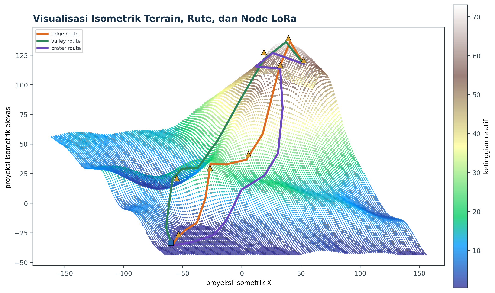

**Gambar 10.5. Visualisasi isometrik jaringan pada terrain simulasi.** Gambar 10.5 menyajikan posisi rute, relay node, dan base station pada bidang isometrik yang mengikuti elevasi terrain. Visualisasi tersebut memperlihatkan bahwa penempatan relay tidak hanya berbasis jarak horizontal, tetapi juga mempertimbangkan perubahan elevasi medan. Kesimpulan yang diperoleh adalah bahwa strategi penempatan relay harus mempertimbangkan topografi agar route multi-hop tetap memiliki peluang LOS atau clearance yang memadai.

### 10.3.2 Pemodelan Pendaki dan GPS

Pendaki dimodelkan sebagai portable node yang bergerak mengikuti waypoint pada rute pendakian. Posisi pendaki dihitung berdasarkan jarak tempuh terhadap waktu, yaitu kecepatan efektif dikalikan durasi simulasi. Kecepatan efektif mengacu pada model cuaca di Bab 4:

$$
v_{eff} = v_{base}F_{weather}
$$

Pendaki pada kondisi cerah bergerak lebih cepat dibandingkan pada kabut, hujan, atau badai. Setiap posisi lokal pendaki kemudian dikaitkan dengan ketinggian terrain, sehingga altitude yang digunakan pada GPS dan model radio berasal dari permukaan gunung yang sama.

Model GPS sintetis digunakan untuk menghasilkan data lokasi yang mendekati karakteristik pembacaan GPS lapangan. Pada awal simulasi, GPS mengalami *Time to First Fix* (TTFF), yaitu periode ketika modul belum memperoleh fix satelit. Setelah fix tersedia, koordinat lokal pendaki dikonversi menjadi latitude dan longitude menggunakan Persamaan 4.1, kemudian ditambahkan gangguan berupa noise, DOP, multipath, delay, dan drift. Noise efektif GPS mengikuti model:

$$
\sigma_{eff} = \sigma_{GPS}DOP + M_{multipath}
$$

Galat posisi GPS dihitung sebagai selisih antara posisi sebenarnya pada terrain dan posisi GPS sintetis yang dilaporkan, sehingga dapat dievaluasi sebagai metrik akurasi lokasi.

DOP dimodelkan meningkat ketika pendaki berada di area yang secara lingkungan sulit untuk penerimaan sinyal satelit, misalnya vegetasi lebat, terrain tertutup, kawah, atau batuan. Multipath dimodelkan sebagai gangguan tambahan ketika pendaki berada dekat permukaan reflektif seperti tebing atau batuan. Dengan model ini, simulasi dapat menunjukkan bahwa kegagalan sistem pelacakan tidak hanya berasal dari radio LoRa, tetapi juga dapat berasal dari kualitas data GPS yang menurun.

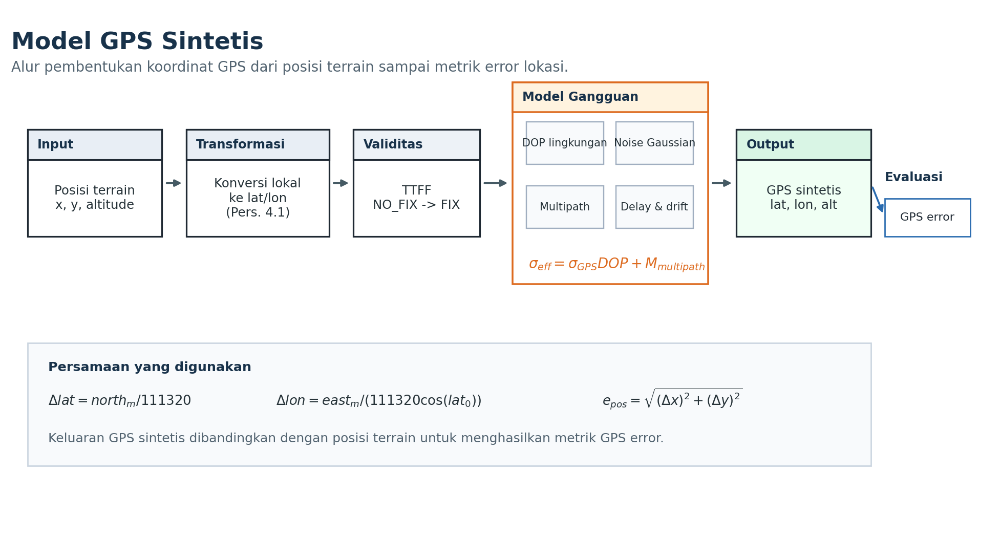

**Gambar 10.6. Alur pembentukan GPS sintetis.** Gambar 10.6 menyajikan tahapan pembentukan koordinat GPS sintetis dari posisi pendaki pada terrain. Proses tersebut mencakup konversi koordinat, validitas TTFF, model gangguan DOP, noise, multipath, delay, dan drift sebelum data dievaluasi sebagai GPS error. Kesimpulan yang diperoleh adalah bahwa data lokasi yang dikirim melalui LoRa merupakan keluaran GPS sintetis yang sudah dipengaruhi gangguan, sehingga evaluasi PoC mencakup akurasi lokasi dan bukan hanya keberhasilan komunikasi.

Baterai portable node juga dimodelkan karena kondisi daya memengaruhi kemampuan transmisi. Konsumsi daya per siklus mengikuti model muatan baterai pada Bab 4:

$$
\Delta Q_{mAh} =
\frac{I_{tx}T_{onair,s}+I_{idle}T_{idle,s}}{3600}
$$

Kapasitas baterai berkurang seiring penggunaan, sedangkan effective TX power dapat menurun ketika state of charge berada pada level rendah. Penurunan TX power berdampak langsung pada link budget karena daya pancar adalah komponen utama dalam perhitungan RSSI. Dengan demikian, baterai tidak hanya menjadi indikator status perangkat, tetapi juga memengaruhi peluang paket sampai ke base station.

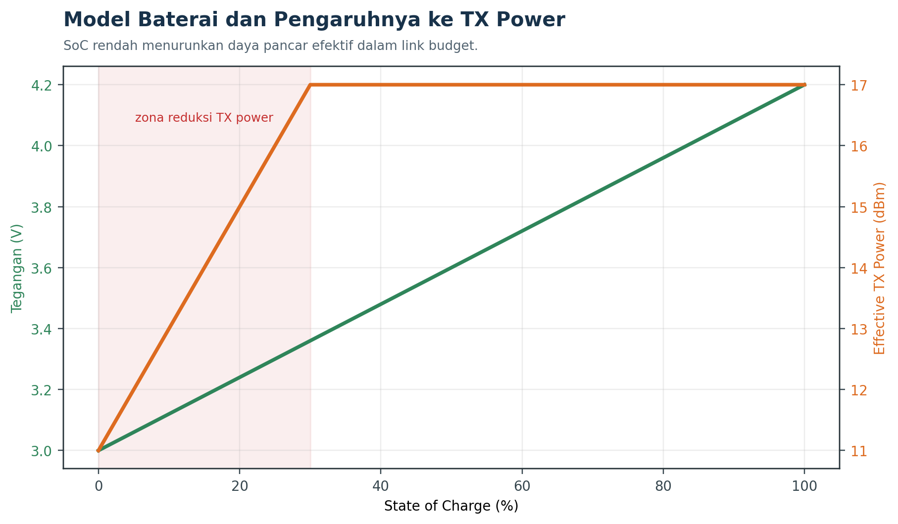

**Gambar 10.7. Hubungan state of charge, tegangan baterai, dan effective TX power.** Gambar 10.7 menunjukkan pengaruh penurunan state of charge terhadap tegangan baterai dan effective TX power. Hubungan ini penting karena daya pancar memengaruhi nilai RSSI dan link margin pada perhitungan link budget. Kesimpulan yang diperoleh adalah bahwa kondisi baterai berpengaruh terhadap kelayakan komunikasi, terutama ketika link radio berada pada margin yang terbatas.

### 10.3.3 Pemodelan LoRa dan Multi-Hop

Pada bagian ini terdapat dua model yang berbeda tetapi saling berhubungan. **Pemodelan LoRa** menjelaskan bagaimana kualitas satu link radio dihitung, misalnya link dari pendaki ke relay atau dari relay ke relay. **Pemodelan multi-hop** menjelaskan bagaimana beberapa link LoRa tersebut disusun menjadi route dari pendaki menuju base station. Dengan kata lain, model LoRa bekerja pada tingkat satu tautan radio, sedangkan model multi-hop bekerja pada tingkat jalur jaringan.

**Pemodelan LoRa: link budget per-tautan.** Model LoRa dalam simulasi berpusat pada perhitungan link budget. Jarak radio dihitung dari koordinat 3D antar-node pada world simulasi yang dikonversi ke meter, bukan dari jarak Haversine GPS. Dengan faktor skala terrain \(S\), jarak link dihitung sebagai:

$$
d_m =
\sqrt{((x_1-x_2)S)^2 + ((y_1-y_2)S)^2 + (z_1-z_2)^2}
$$

Dengan demikian, jarak link mencakup perbedaan posisi horizontal dan perbedaan ketinggian. Untuk redaman dasar, simulasi menggunakan Free-Space Path Loss (FSPL) sebagaimana Persamaan 4.6:

$$
FSPL_{dB} = 32{,}44 + 20\log_{10}(d_{km}) + 20\log_{10}(f_{MHz})
$$

Setelah FSPL dihitung, simulasi menambahkan loss lain yang berasal dari obstacle, terrain shadow, diffraction, terrain scatter, cuaca, kelembapan, temperatur, dan fading. Daya terima dihitung menggunakan persamaan link budget sebagaimana Persamaan 4.8:

$$
P_{rx} = P_{tx} + G_{tx} + G_{rx} - L_{total}
$$

Link margin kemudian diperoleh dari selisih daya terima dan sensitivitas receiver:

$$
M_{link} = P_{rx} - S_{rx}
$$

Nilai margin ini menjadi dasar untuk menentukan apakah sebuah link layak digunakan. Margin positif menunjukkan daya terima berada di atas sensitivitas receiver, sedangkan margin negatif menunjukkan link berada di bawah batas penerimaan. Sensitivitas receiver bergantung pada spreading factor. SF yang lebih tinggi memiliki sensitivitas lebih baik, tetapi menghasilkan data rate lebih rendah dan time on air lebih panjang.

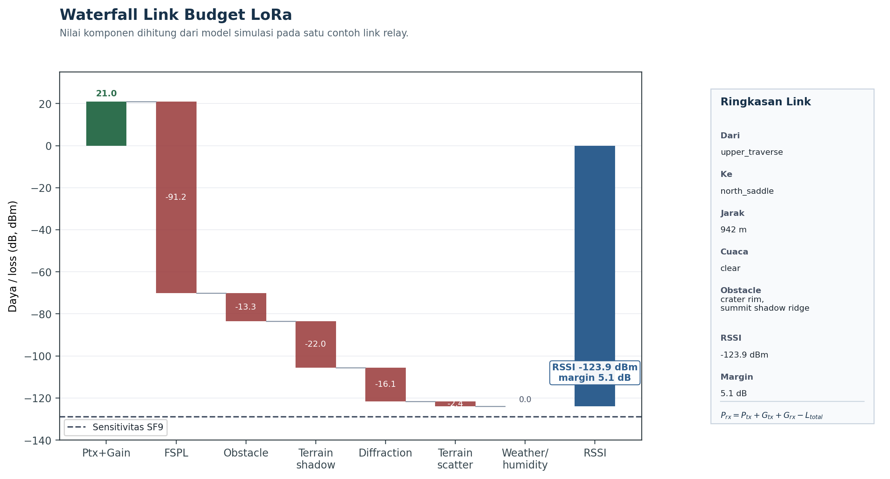

**Gambar 10.8. Komponen link budget LoRa.** Gambar 10.8 menyajikan waterfall link budget untuk contoh link `node_upper_traverse` menuju `node_north_saddle` pada cuaca cerah. Komponen redaman seperti FSPL, obstacle loss, terrain shadow, diffraction, dan terrain scatter mengurangi daya awal hingga menghasilkan RSSI akhir. Link dinyatakan layak karena link margin bernilai positif, yaitu RSSI masih berada di atas sensitivitas receiver SF9; namun margin yang hanya beberapa dB menunjukkan bahwa link masih rentan terhadap fading, cuaca buruk, atau tambahan obstacle loss. Kesimpulan yang diperoleh adalah bahwa kelayakan satu link tidak cukup dilihat dari ada atau tidaknya koneksi, tetapi harus dilihat dari besarnya margin cadangan terhadap sensitivitas receiver.

**Pemodelan multi-hop: pemilihan route antar-relay.** Setelah kualitas tiap link LoRa dihitung, simulasi membangun graf konektivitas jaringan. Simpul graf terdiri atas pendaki, relay node, dan base station, sedangkan edge graf hanya dianggap layak jika link budget menunjukkan margin yang memenuhi ambang komunikasi. Dengan cara ini, multi-hop tidak dihitung dari jarak terdekat saja, melainkan dari kumpulan link yang secara radio masih memungkinkan untuk meneruskan paket.

Routing multi-hop dilakukan dengan memilih relay yang memiliki link layak dan tetap memiliki jalur menuju base station. Graf konektivitas dibangun dari base station dan relay node. Setiap edge dievaluasi menggunakan link budget deterministik, yaitu perhitungan tanpa fading acak. Pemilihan route dibuat deterministik agar jalur tidak berubah-ubah hanya karena fluktuasi fading sesaat. Setelah route dipilih, komponen fading tetap dihitung untuk mengevaluasi kondisi paket aktual.

Algoritma pencarian rute menggunakan prinsip Dijkstra, yaitu memilih jalur dengan biaya paling rendah menuju base station. Biaya rute mempertimbangkan jumlah hop dan jarak. Dengan pendekatan ini, sistem tidak selalu memilih relay terdekat secara lokal, tetapi memilih jalur yang secara keseluruhan memiliki peluang lebih baik untuk sampai ke base station.

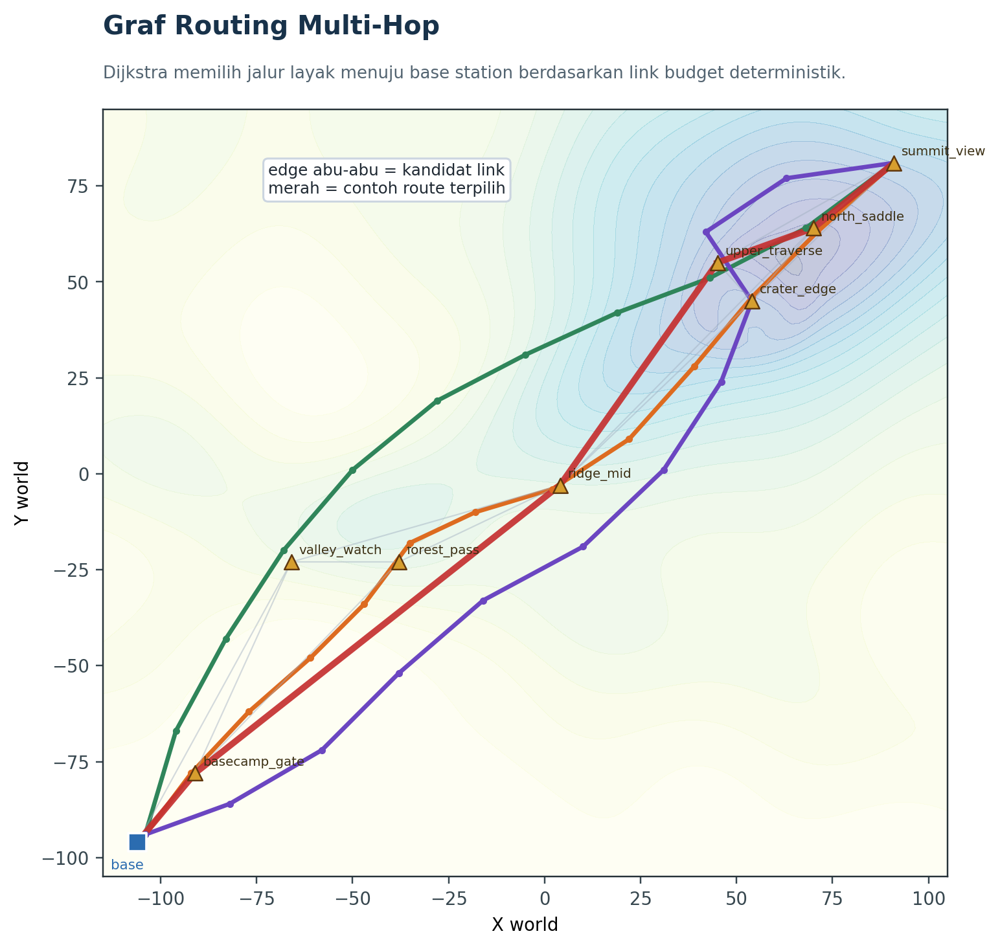

**Gambar 10.9. Graf konektivitas dan pemilihan route multi-hop.** Gambar 10.9 menyajikan graf konektivitas antar-node yang dibangun dari hasil evaluasi link budget. Jalur yang dipilih menunjukkan prinsip routing multi-hop, yaitu paket diarahkan melalui relay yang memberikan jalur layak menuju base station. Kesimpulan yang diperoleh adalah bahwa pemilihan route dilakukan berdasarkan kelayakan link secara jaringan, bukan hanya berdasarkan relay terdekat dari pendaki.

Spreading factor memengaruhi tiga aspek utama: sensitivitas receiver, time on air, dan risiko duty cycle. Time on air dihitung dari durasi simbol LoRa \(T_{sym}=2^{SF}/BW\) sebagaimana Persamaan 4.10. Pada SF rendah, paket lebih cepat dikirim tetapi jangkauan lebih pendek. Pada SF tinggi, sensitivitas meningkat tetapi time on air bertambah sehingga peluang collision dan beban duty cycle juga meningkat. Trade-off ini menjadi dasar pemilihan parameter LoRa pada skenario pengujian.

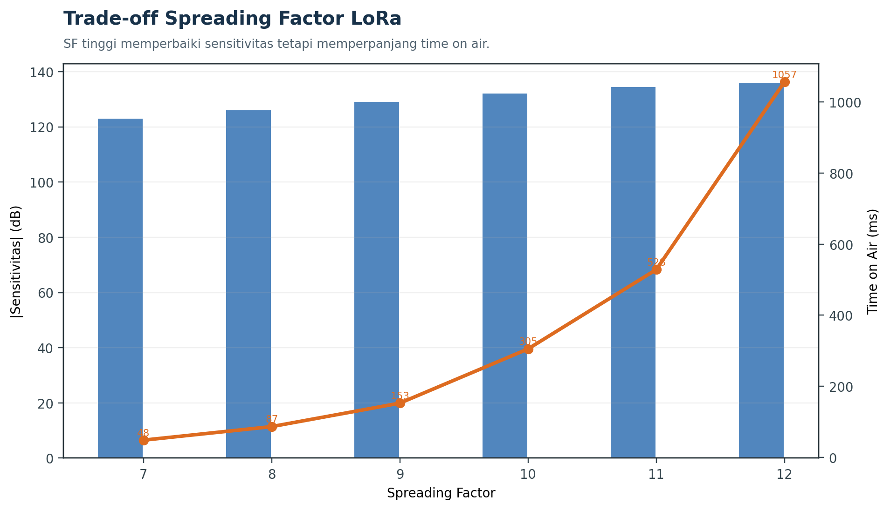

**Gambar 10.10. Trade-off spreading factor terhadap sensitivitas, time on air, dan duty cycle.** Gambar 10.10 memperlihatkan konsekuensi pemilihan spreading factor pada komunikasi LoRa. Peningkatan SF memperbaiki sensitivitas receiver, tetapi juga meningkatkan time on air sehingga dapat memperbesar risiko collision dan beban duty cycle. Kesimpulan yang diperoleh adalah bahwa konfigurasi LoRa harus dipilih sebagai kompromi antara jangkauan, durasi transmisi, dan kapasitas jaringan.

### 10.3.4 Pemodelan Cuaca

Cuaca dimodelkan sebagai variabel skenario yang memengaruhi dua subsistem sekaligus, yaitu pergerakan pendaki dan komunikasi LoRa. Pada pergerakan pendaki, cuaca mengubah kecepatan efektif melalui faktor \(F_{weather}\). Kondisi cerah menggunakan faktor 1,00, kabut 0,85, hujan ringan 0,80, hujan lebat 0,65, dan badai petir 0,50. Dengan demikian, cuaca buruk membuat pendaki bergerak lebih lambat di sepanjang waypoint rute.

Pada komunikasi LoRa, cuaca memengaruhi link budget melalui tiga komponen. Pertama, cuaca menambahkan weather loss yang bergantung pada jarak:

$$
L_{weather} = a_w d_{km} + n_w
$$

Kedua, cuaca meningkatkan redaman vegetasi melalui wet foliage factor. Faktor ini membuat obstacle jenis vegetasi menghasilkan loss lebih besar pada kondisi kabut, hujan, dan badai. Ketiga, cuaca buruk dapat menambahkan peluang drop paket independen dari PER, khususnya pada hujan lebat dan badai petir. Secara implementasi simulasi, profil cuaca yang digunakan adalah sebagai berikut.

| Cuaca | \(a_w\) (dB/km) | \(n_w\) (dB) | Extra drop | Wet factor | Speed factor |
|---|---:|---:|---:|---:|---:|
| `clear` | 0,00 | 0,0 | 0,00 | 1,00 | 1,00 |
| `fog` | 0,00 | 0,5 | 0,00 | 1,15 | 0,85 |
| `light_rain` | 0,01 | 1,0 | 0,00 | 1,40 | 0,80 |
| `heavy_rain` | 0,05 | 3,0 | 0,05 | 1,70 | 0,65 |
| `thunderstorm` | 0,10 | 8,0 | 0,15 | 2,00 | 0,50 |

Model ini sengaja tidak mengklaim sebagai model meteorologi penuh. Cuaca pada simulasi berfungsi sebagai profil gangguan komputasional yang dapat memperlihatkan degradasi performa sistem secara bertahap dari kondisi normal menuju kondisi buruk. Parameter tersebut masih perlu dikalibrasi pada Capstone 2 menggunakan pengujian perangkat keras dan kondisi lingkungan nyata.

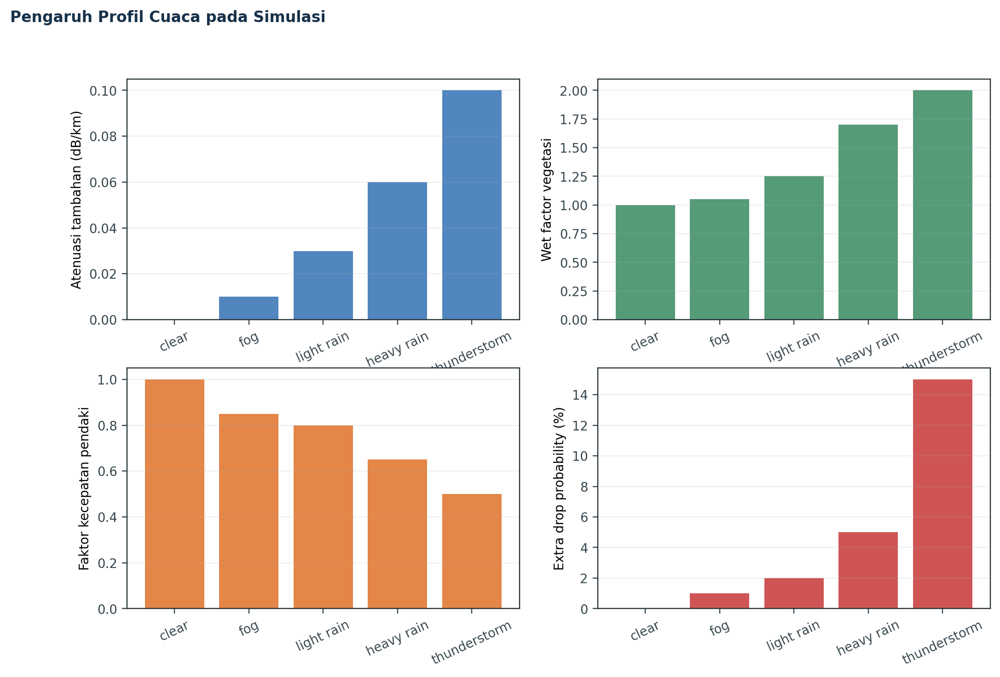

**Gambar 10.11. Pemodelan cuaca pada simulasi.** Gambar 10.11 merangkum pengaruh profil cuaca terhadap parameter simulasi. Cuaca memengaruhi redaman radio, wet foliage factor, peluang drop tambahan, dan kecepatan pendaki sehingga digunakan sebagai salah satu variabel gangguan pada skenario pengujian. Kesimpulan yang diperoleh adalah bahwa cuaca buruk menurunkan performa sistem melalui dua jalur sekaligus, yaitu melemahkan komunikasi radio dan memperlambat pergerakan pendaki.

### 10.3.5 Pemodelan Gangguan dan Metrik Evaluasi

Gangguan pada simulasi dibagi menjadi dua kelompok besar, yaitu gangguan GPS dan gangguan komunikasi LoRa. Gangguan GPS mencakup TTFF, noise, DOP, multipath, hardware delay, dan clock drift. Gangguan LoRa mencakup path loss, obstacle loss, terrain shadow, diffraction loss, fading, weather loss, humidity loss, temperature noise, PER, collision, duty cycle, dan ketiadaan route valid. Duty cycle dievaluasi menggunakan rolling window Time on Air selama satu jam:

$$
D_{used}=\frac{\sum_{3600s}T_{onair,s}}{3600}
$$

Jika nilai tersebut melewati batas simulasi yang ditetapkan, paket dapat dijatuhkan dengan alasan `duty_cycle`.

Probabilitas kegagalan paket dihitung menggunakan fungsi sigmoid terhadap link margin sebagaimana Persamaan 4.16:

$$
PER = \frac{1}{1 + e^{0{,}8(M_{link} - 2)}}
$$

Fungsi ini membuat paket hampir selalu gagal ketika margin jauh di bawah sensitivitas receiver, dan semakin andal ketika margin bertambah positif. Pada komunikasi multi-hop, peluang berhasil end-to-end dipengaruhi oleh peluang berhasil pada setiap hop, sebagaimana prinsip PDR end-to-end pada Persamaan 4.18. Artinya, route dengan lebih banyak hop hanya layak jika setiap hop memiliki margin yang cukup.

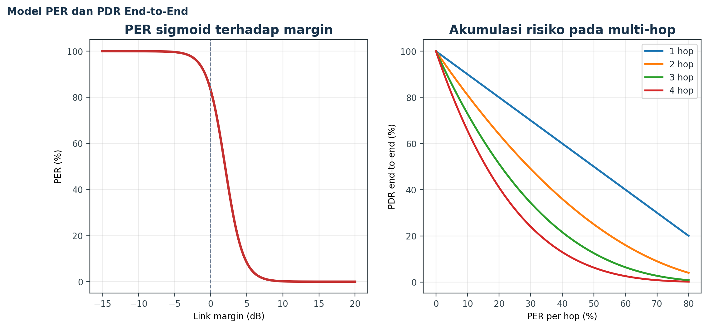

**Gambar 10.12. Hubungan link margin, PER, dan PDR end-to-end.** Gambar 10.12 menunjukkan bahwa link margin memengaruhi probabilitas kegagalan paket melalui model PER. Pada route multi-hop, keberhasilan end-to-end bergantung pada kualitas setiap hop sehingga penambahan hop harus tetap mempertahankan margin yang memadai pada tiap link. Kesimpulan yang diperoleh adalah bahwa route multi-hop baru menguntungkan jika setiap hop memiliki kualitas link yang cukup; penambahan hop pada link marginal justru dapat menurunkan PDR end-to-end.

Simulasi juga mencatat alasan kegagalan paket dalam variabel `drop_reason`. Kategori utama yang digunakan adalah `no_route`, `per_model`, `collision`, `duty_cycle`, `weather`, dan `protocol`. `no_route` menunjukkan tidak ada jalur relay yang layak menuju base station. `per_model` menunjukkan paket gagal karena probabilitas error berdasarkan margin. `collision` menunjukkan adanya risiko tabrakan transmisi ketika banyak node aktif. `duty_cycle` menunjukkan batas time on air dalam jendela waktu telah terlampaui. `weather` menunjukkan gangguan tambahan akibat cuaca buruk. `protocol` mencakup kegagalan protokol seperti CRC atau batas hop.

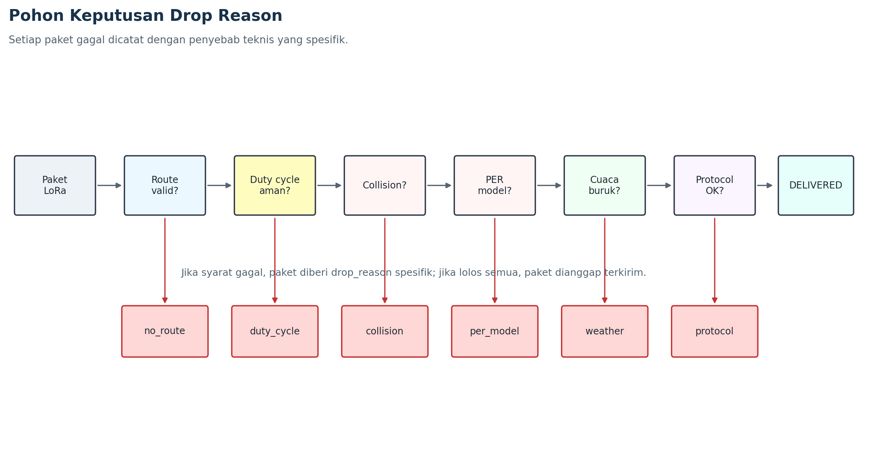

**Gambar 10.13. Mekanisme penentuan drop reason.** Gambar 10.13 menyajikan alur klasifikasi kegagalan paket. Setiap paket yang gagal diberi alasan teknis, seperti `no_route`, `per_model`, `collision`, `duty_cycle`, `weather`, atau `protocol`, sehingga hasil simulasi dapat dianalisis berdasarkan penyebab kegagalan. Kesimpulan yang diperoleh adalah bahwa kegagalan paket pada simulasi bersifat terdiagnosis, sehingga penurunan PDR dapat ditelusuri ke penyebab teknis tertentu.

Metrik evaluasi yang digunakan meliputi GPS error, RSSI, SNR, link margin, hop count, latency, PDR, distribusi drop reason, time on air, duty cycle, dan state of charge baterai. Kumpulan metrik ini dipilih karena mewakili tiga aspek utama PoC: akurasi lokasi, kelayakan komunikasi, dan keberlanjutan operasi perangkat.

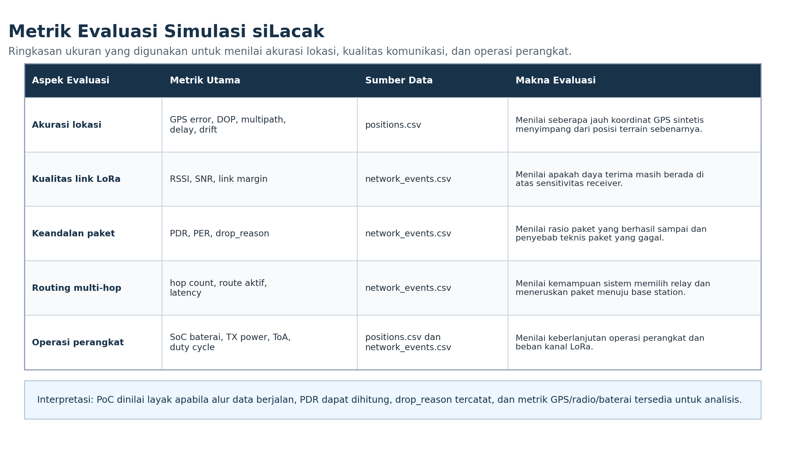

**Gambar 10.14. Ringkasan metrik evaluasi simulasi.** Gambar 10.14 merangkum metrik utama yang digunakan untuk mengevaluasi simulasi. Tabel tersebut menghubungkan aspek evaluasi, metrik, sumber data, dan makna analisis sehingga proses penilaian PoC dapat ditelusuri dari data log simulasi. Kesimpulan yang diperoleh adalah bahwa PoC dinilai dari beberapa aspek terukur, yaitu akurasi lokasi, kualitas komunikasi, reliabilitas pengiriman, latensi, energi, dan penyebab kegagalan.

## 10.4 Skenario Pengujian

Skenario pengujian disusun untuk memperlihatkan perilaku sistem pada kondisi yang berbeda. Simulasi tidak hanya dijalankan pada satu rute ideal, tetapi juga pada rute dengan karakteristik topografi dan obstacle yang berbeda. Dengan demikian, PoC dapat menunjukkan bahwa model sistem tetap dapat dievaluasi ketika kondisi medan berubah.

Skenario pertama adalah variasi rute pendakian. Ridge route digunakan sebagai rute yang relatif lebih terbuka dan mengikuti punggungan. Valley route digunakan untuk menguji pengaruh vegetasi, lembah, dan NLOS. Crater route digunakan untuk mengevaluasi area kawah dan difraksi terrain. Ketiga rute ini memberikan konteks yang berbeda bagi link budget dan GPS error.

Skenario kedua adalah multi-pendaki. Pada skenario ini, beberapa portable node berjalan secara simultan sehingga jaringan harus menangani lebih banyak paket, peluang collision meningkat, dan relay tertentu dapat menerima beban trafik lebih tinggi. Skenario ini penting karena sistem siLacak dirancang untuk memantau lebih dari satu pendaki.

Skenario ketiga adalah variasi cuaca. Kondisi yang digunakan mencakup cerah, kabut, hujan ringan, hujan lebat, dan badai. Cuaca memengaruhi kecepatan pendaki, redaman tambahan, faktor basah vegetasi, dan peluang drop paket. Dengan skenario ini, simulasi dapat memperlihatkan degradasi performa secara bertahap dari kondisi normal menuju kondisi buruk.

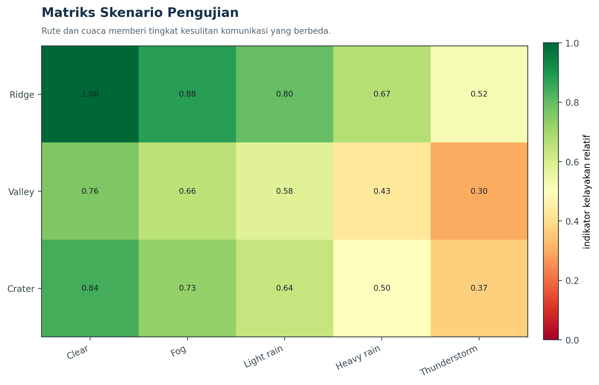

**Gambar 10.15. Matriks skenario pengujian simulasi.** Gambar 10.15 menyajikan kombinasi rute pendakian, jumlah pendaki, dan kondisi cuaca yang digunakan dalam pengujian. Matriks ini menunjukkan cakupan skenario untuk menguji performa sistem pada kondisi medan dan gangguan yang berbeda. Kesimpulan yang diperoleh adalah bahwa evaluasi simulasi tidak dilakukan pada satu kondisi ideal saja, tetapi mencakup variasi medan, beban jaringan, dan kondisi lingkungan.

## 10.5 Output dan Evaluasi Simulasi

Output simulasi terdiri atas tampilan real-time dan data pascasimulasi. Tampilan real-time diberikan melalui dashboard terminal yang menampilkan waktu simulasi, identitas pendaki, koordinat GPS, baterai, cuaca, spreading factor, time on air, statistik paket, route aktif, dan status link. Dashboard ini digunakan untuk memantau apakah simulasi berjalan, apakah paket terkirim, serta alasan umum ketika paket gagal.

Untuk evaluasi kuantitatif, simulasi menyimpan data ke dalam dua file CSV utama. `positions.csv` menyimpan data posisi pendaki, rute, posisi sebenarnya pada terrain, koordinat GPS sintetis, error GPS, DOP, drift, delay, dan cuaca. `network_events.csv` menyimpan data event LoRa, antara lain status delivered/drop, drop reason, RSSI, SNR, margin, FSPL, obstacle loss, terrain shadow, diffraction loss, fading, weather loss, spreading factor, data rate, time on air, duty cycle, route, dan hop count.

Data CSV tersebut digunakan untuk membuat grafik evaluasi. Karena grafik dihasilkan dari model dan data simulasi, setiap metrik dapat ditelusuri kembali ke variabel yang digunakan dalam simulasi. Misalnya, PDR dapat ditelusuri dari status delivered, kegagalan dapat ditelusuri dari `drop_reason`, dan kualitas link dapat ditelusuri dari RSSI, SNR, serta margin. Hal ini membuat simulasi layak digunakan sebagai bukti konsep, walaupun belum menggantikan pengukuran perangkat keras.

## 10.6 Hasil Proof of Concept

Hasil PoC dievaluasi dari tiga sudut pandang: alur data end-to-end, kemampuan multi-hop, dan kemampuan analisis kegagalan. Pada alur end-to-end, simulasi membuktikan bahwa posisi pendaki dapat dihasilkan oleh model GPS, dikemas sebagai paket, dievaluasi oleh jaringan LoRa, diteruskan melalui relay, diterima oleh base station ketika route valid, dan dicatat ke log evaluasi. Ini menunjukkan bahwa rancangan sistem dapat direpresentasikan sebagai alur kerja yang lengkap.

Pada aspek multi-hop, simulasi menunjukkan bahwa paket tidak bergantung pada direct link dari pendaki ke base station. Ketika link langsung tidak cukup kuat, sistem dapat mengevaluasi relay dan memilih route yang memiliki jalur menuju base station. Hal ini merupakan inti dari konsep siLacak, karena medan gunung sering menyebabkan NLOS dan pelemahan sinyal pada link langsung.

Pada aspek analisis kegagalan, simulasi mencatat alasan paket gagal melalui `drop_reason`. Informasi ini penting karena kegagalan paket dapat disebabkan oleh faktor yang berbeda-beda, misalnya tidak ada route valid, margin terlalu kecil, collision, duty cycle, cuaca, atau protokol. Dengan adanya klasifikasi ini, evaluasi tidak berhenti pada angka PDR, tetapi dapat menjelaskan penyebab teknis penurunan performa.
    
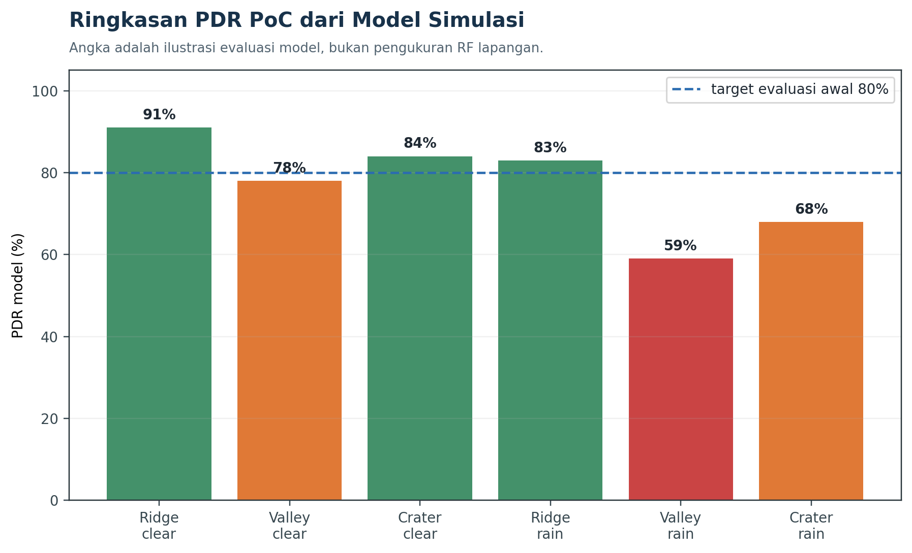

**Gambar 10.16. Ringkasan PDR pada skenario PoC.** Gambar 10.16 menyajikan ringkasan PDR pada beberapa skenario evaluasi model. Nilai yang ditampilkan harus dibaca sebagai hasil simulasi komputasional, bukan sebagai hasil pengukuran RF lapangan. Kesimpulan yang diperoleh adalah bahwa PDR dapat digunakan sebagai indikator utama keberhasilan pengiriman paket, sedangkan variasi PDR antar-skenario menunjukkan sensitivitas sistem terhadap kondisi medan, cuaca, dan jumlah pendaki.

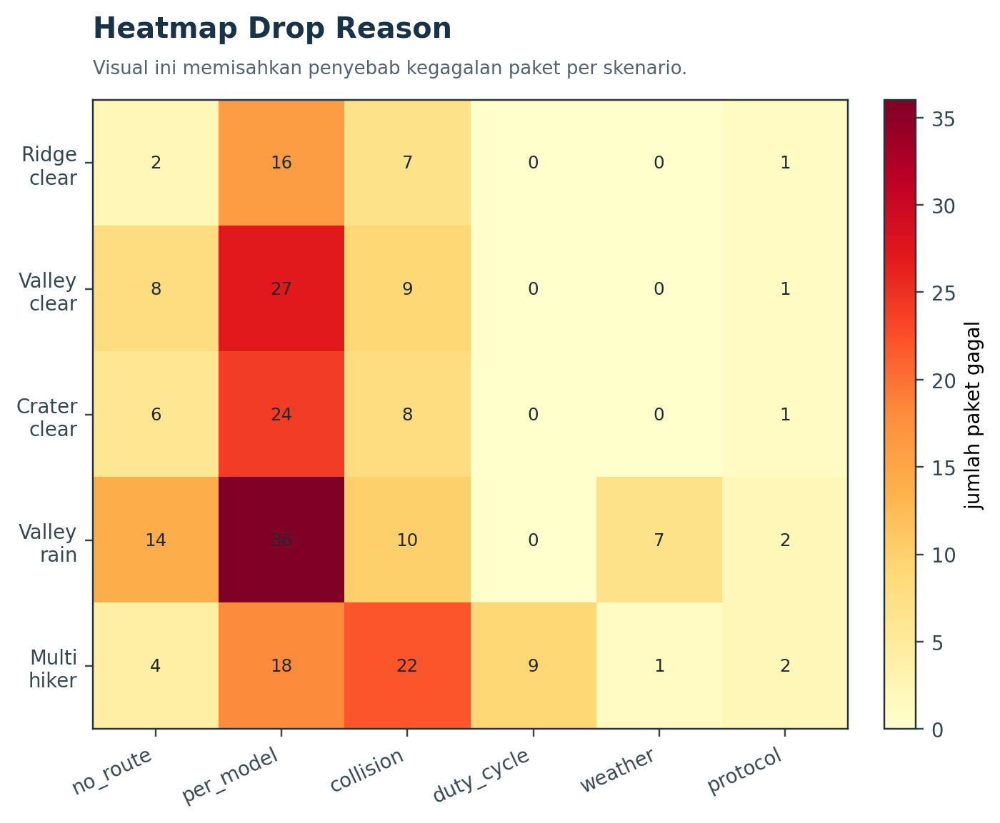

**Gambar 10.17. Heatmap drop reason pada skenario simulasi.** Gambar 10.17 menyajikan distribusi penyebab kegagalan paket pada setiap skenario. Heatmap ini digunakan untuk mengidentifikasi apakah penurunan performa lebih dominan disebabkan oleh kondisi route, PER, collision, duty cycle, cuaca, atau protokol. Kesimpulan yang diperoleh adalah bahwa analisis kegagalan tidak berhenti pada nilai paket gagal, tetapi dapat menunjukkan mekanisme teknis yang paling berpengaruh pada setiap skenario.

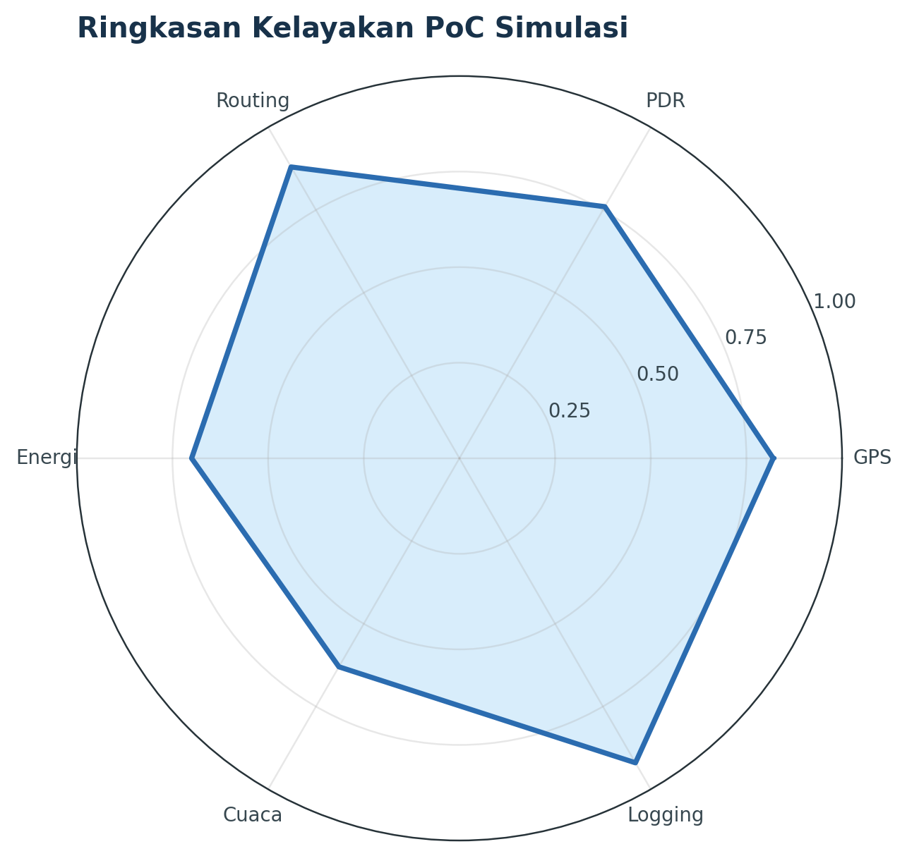

**Gambar 10.18. Ringkasan metrik PoC.** Gambar 10.18 menyajikan ringkasan agregat beberapa indikator utama PoC, meliputi GPS, PDR, routing, energi, cuaca, dan logging. Visualisasi ini berfungsi sebagai ringkasan akhir bahwa simulasi dapat dinilai dari beberapa dimensi teknis, bukan hanya dari keberhasilan visualisasi. Kesimpulan yang diperoleh adalah bahwa sistem simulasi sudah memenuhi fungsi PoC karena dapat menghasilkan lokasi, mengevaluasi komunikasi, memilih route, mencatat kegagalan, dan menyediakan data analisis.

## 10.7 Batasan Simulasi

Simulasi ini memiliki beberapa batasan yang perlu dinyatakan agar interpretasi hasil tetap tepat. Pertama, simulasi bukan pengukuran RF lapangan. Nilai RSSI, SNR, margin, PDR, dan loss berasal dari model matematis dan parameter heuristik, sehingga perlu divalidasi dengan perangkat LoRa nyata pada Capstone 2.

Kedua, obstacle radio dimodelkan sebagai zona abstrak. Vegetasi, batuan, kawah, dan terrain shadow tidak dimodelkan sebagai objek fisik individual, melainkan sebagai area yang memberikan redaman tambahan. Pendekatan ini cukup untuk PoC karena dapat menunjukkan pengaruh lingkungan terhadap komunikasi, tetapi belum dapat menggantikan survei radio detail di lokasi sebenarnya.

Ketiga, GPS yang digunakan adalah GPS sintetis. Model TTFF, DOP, noise, multipath, drift, dan delay dibuat untuk merepresentasikan gangguan umum, tetapi belum menggantikan karakteristik modul GPS fisik yang dipengaruhi antena, orientasi perangkat, cuaca aktual, dan visibilitas satelit nyata.

Keempat, model cuaca, fading, PER, collision, duty cycle, dan baterai disederhanakan agar simulasi dapat berjalan ringan. Penyederhanaan ini dapat dipertanggungjawabkan untuk tahap PoC, tetapi parameter akhirnya tetap harus dikalibrasi melalui pengujian perangkat keras.

## 10.8 Kesimpulan Simulasi

Simulasi pendahuluan siLacak layak digunakan sebagai *proof of concept* Capstone 1 karena berhasil menunjukkan bahwa rancangan sistem dapat dimodelkan secara terintegrasi. Lingkungan gunung, GPS sintetis, jaringan LoRa multi-hop, gangguan paket, dashboard, dan logging dapat berjalan dalam satu alur simulasi. Data lokasi dapat dibangkitkan, kualitas link dapat dihitung, relay dapat dipilih, paket dapat dievaluasi, dan hasilnya dapat dianalisis melalui log serta grafik.

Kesimpulan utama dari Bab 10 adalah bahwa konsep siLacak dapat dijalankan dan diuji secara komputasional sebelum perangkat keras dibuat. Simulasi memberikan bukti awal bahwa rancangan multi-hop lebih sesuai untuk medan gunung dibandingkan komunikasi langsung, karena paket dapat diarahkan melalui relay ketika link langsung tidak memadai. Selain itu, pencatatan `drop_reason` membuat kegagalan paket dapat dianalisis secara teknis, bukan hanya dinyatakan sebagai paket hilang.

Hasil simulasi ini menjadi dasar untuk tahap Capstone 2. Pada tahap berikutnya, parameter model seperti obstacle loss, diffraction loss, fading, PER, collision, konsumsi daya, dan akurasi GPS perlu dikalibrasi menggunakan pengukuran perangkat keras di lapangan. Dengan demikian, Bab 10 berfungsi sebagai penghubung antara perancangan matematis dan implementasi fisik sistem siLacak.
